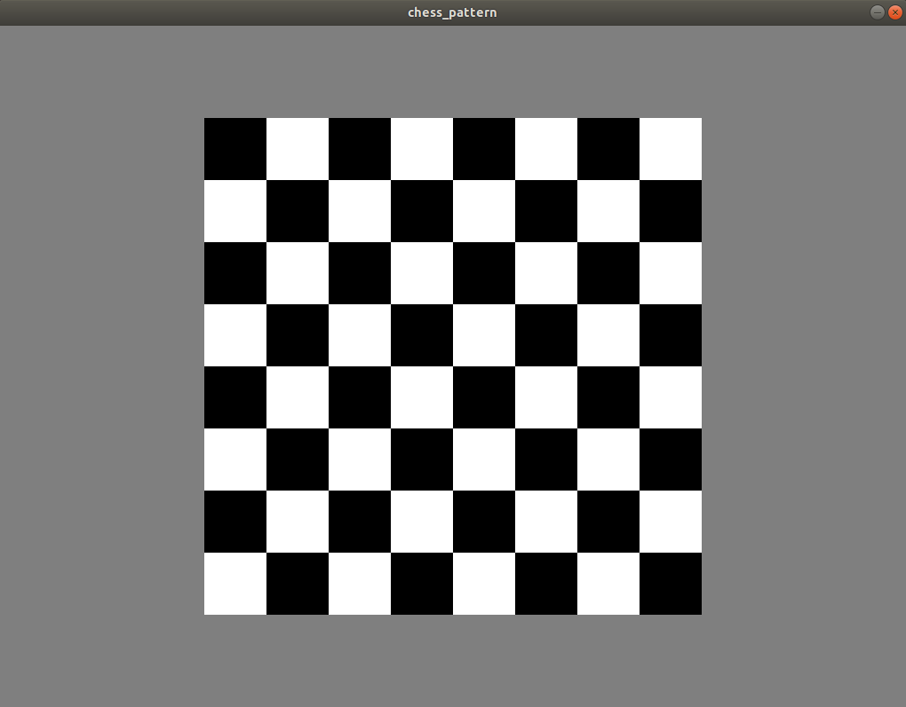

# A simple chess pattern generator application in C++ using SDL2

## Requirements
Install SDL2 libraries on the system.
```
$ sudo apt-get install libsdl2-dev
```

## Building the project
```
 $ git clone https://github.com/mykhani/chess_pattern_SDL.git
 $ cd chess_pattern_SDL
 $ mkdir build
 $ cd build
 $ cmake ../
 $ make
```

## Running the application
```
./drawChessPattern
```

Here's the snapshot of the application.


